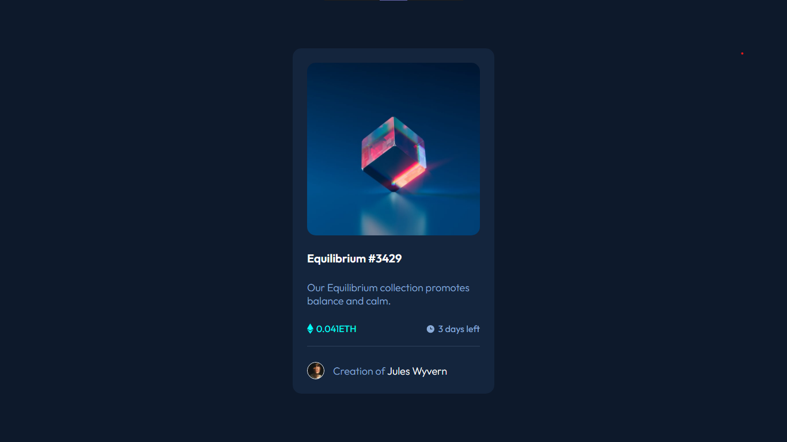

# Frontend Mentor - NFT preview card component solution

This is a solution to the [NFT preview card component challenge on Frontend Mentor](https://www.frontendmentor.io/challenges/nft-preview-card-component-SbdUL_w0U). Frontend Mentor challenges help you improve your coding skills by building realistic projects.

## Table of contents

- [Screenshot](#screenshot)
- [Built with](#built-with)
- [What I learned](#what-i-learned)
- [Continued development](#continued-development)
- [Useful resources](#useful-resources)
- [Acknowledgments](#acknowledgments)

### Screenshot



### Built with

- Semantic HTML5 markup
- CSS custom properties
- Flexbox

### What I learned

- Majority of the focus was using Flex property. I learned to include flex as per necessary like distributing elements across the card-component.

```html
<main>
  <div class="card">
    <div class="card-image">
      
      <div class="overlay">
        
      </div>
    </div>
    <h1>Equilibrium #3429</h1>
    <p>Our Equilibrium collection promotes balance and calm.</p>
    <div class="value-days">
      <div class="value">
        
        <span>0.041ETH</span>
      </div>
      <div class="days">
        
        <span>3 days left</span>
      </div>
    </div>
    <div class="creator">
      
      <p>Creation of <span>Jules Wyvern</span></p>
    </div>
  </div>
</main>
```

```css
main {
  height: 100vh;
  background-color: var(--main-BG);
  display: flex;
  justify-content: center;
  align-items: center;
}
.card {
  background-color: var(--card-BG);
  width: 350px;
  height: 600px;
  padding: 25px;
  border-radius: 15px;
  display: flex;
  flex-direction: column;
  justify-content: space-between;
}
.card-image {
  position: relative;
}
.card-image .equilibrium {
  width: 300px;
  border-radius: 15px;
  display: flex;
  justify-content: center;
  align-items: center;
}
```

### Continued development

- The challenging part of this exercise for me was to align the overlay and view icon on the primary image that appears only over hovering the image. Though I struggule over this particular challenge and completed it, I would love to champion this case and continue sharpen my skill.

### Useful resources

- [lauraamujica NFT-Preview-card-component](https://github.com/lauraamujica/NFT-Preview-card-component-) - lauraamujica has inspired me with this clean, easy to understand code. I took reference this repo when I got stuck and would recommend visting.

**Other resources**

- https://www.youtube.com/watch?v=l6sxh57ifSQ
- https://www.youtube.com/watch?v=9bGbykdR4T8

## Acknowledgments

https://github.com/lauraamujica
